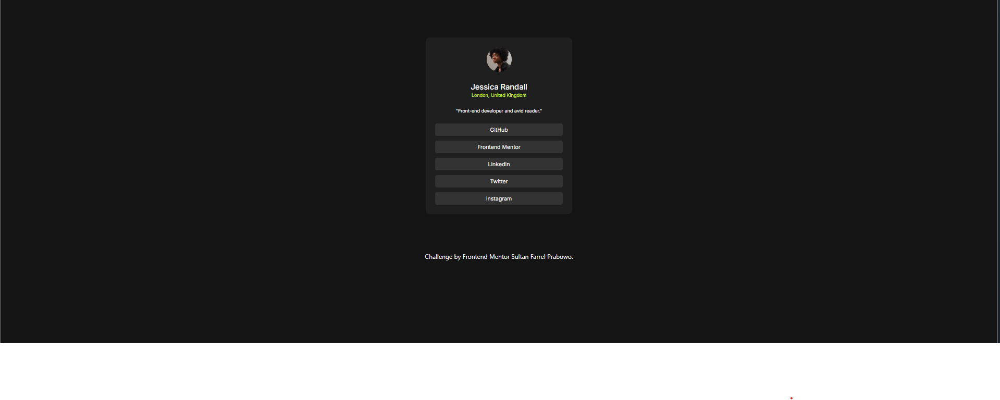
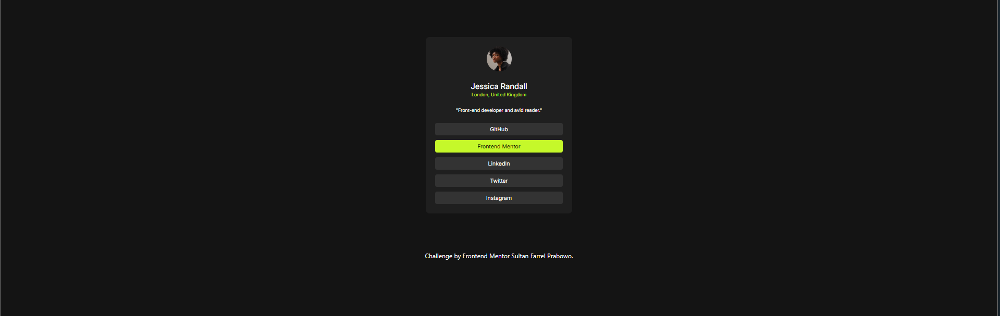
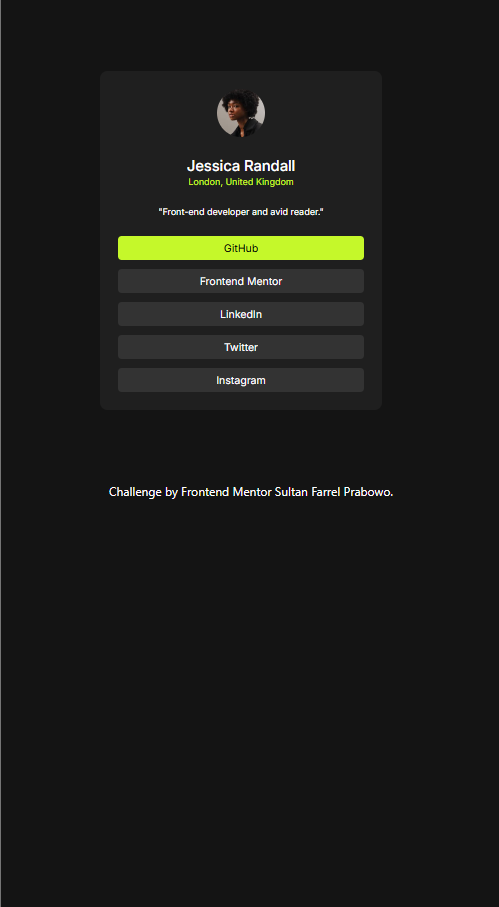

# Frontend Mentor - Social links profile solution

This is a solution to the [Social links profile challenge on Frontend Mentor](https://www.frontendmentor.io/challenges/social-links-profile-UG32l9m6dQ). Frontend Mentor challenges help you improve your coding skills by building realistic projects. 

## Table of contents

- [Overview](#overview)
  - [Screenshot](#screenshot)
  - [Links](#links)
  - [Built with](#built-with)
- [Author](#author)

## Overview
### Social Link Profile Component
The Social Link Profile is a clean and modern web project designed for showcasing a user's social media links in an attractive and minimalist profile page. The design is responsive and optimized for various screen sizes, making it perfect for desktop and mobile users alike.

This project is built using Tailwind CSS for styling, enabling rapid development with a utility-first approach. The interface features a user profile section with a picture, name, location, and bio. Below this, a list of social media buttons is displayed, allowing visitors to quickly access the user's profiles on popular platforms such as GitHub, LinkedIn, Twitter, and Instagram.

The project also includes credits to the developer and the platform used for the challenge, creating a professional and polished appearance.

#### Features:
* Responsive design that adapts to desktop and mobile views.
* A central profile card with social media links.
* Custom styling using Tailwind CSS.
* Easy-to-edit components, allowing developers to add, remove, or modify the social media links as needed.
* Clear and simple layout focusing on usability and aesthetics.

Feel free to explore and use this component in your own projects, whether for blog previews or other content that benefits from a compact, visually striking design.

### Screenshot

### Links

- Solution URL: [Add solution URL here](https://your-solution-url.com)
- Live Site URL: [Add live site URL here](https://your-live-site-url.com)

### Built with

- Semantic HTML5 markup
- Tailwind CSS
- Flexbox
- Mobile-first workflow

## Author

- Website - [Sultan Farrel](https://www.sultanf.my.id)
- Frontend Mentor - [@SultanFarrel](https://www.frontendmentor.io/profile/SultanFarrel)
- Instagram - [@farrelsultan15](https://www.instagram.com/farrelsultan15)
